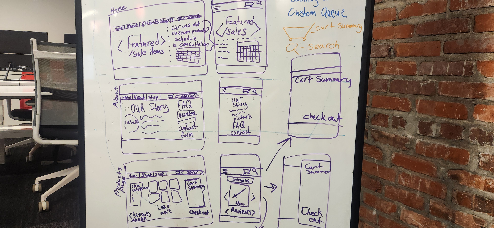
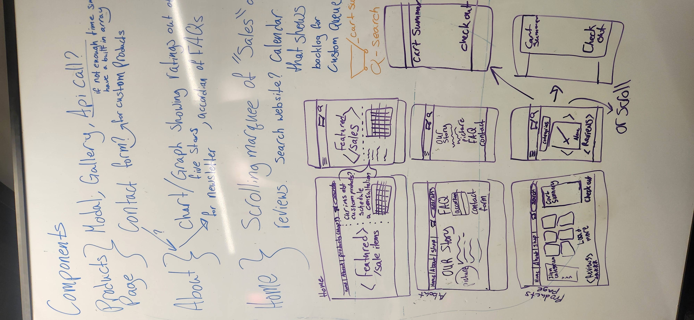

# Production Log

In Weeks 1 & 2, I used a file titled `AssignmentDeliverables` that outlined how each project covered the tasks in their respective `README.md` files. 
This week I am changing my approach. I've created this log to record implementation decisions, completed work, issues, and verification evidence as I work on the assignment. It will also serve as a roadmap for the app's development.

## 1. Project Planning and Scope

### Date: `9/17/26`

### Goals and acceptance criteria:

- [x] Decide on App functionality
- [x] Wireframe pages (at least three)

### Notes and decisions:

- [x] Review React Router
- [x] Review React Hooks
- [x] Review `useState`
- [x] Search for Shadcn Inspiration
- [x] Define the workshop storefront direction with Home, Products, Cart, and About pages

## 2. Development Environment Setup

### Date: `9/17/26`

### Work completed:

- Added Zustand for client-side cart and theme state.
- Configured the Shadcn Studio `@ss-blocks` registry in `components.json`.
- Added the Shadcn Studio Product List 01 block without replacing the project's customized Button, Card, or utility files.

### Dependencies and tools configured:

- React, React Router, Tailwind CSS v4, shadcn/ui, Lucide icons, and Zustand.
- Shadcn Studio registry: `https://shadcnstudio.com/r/blocks/{style}/{name}.json`.

### Verification:

- Focused ESLint checks pass for the implemented product and state files.
- Full TypeScript validation was initially blocked by unfinished page exports; the route pages have since been implemented.

## 3. React Application Initialization

### Date: `9/18/26`

### Work completed:

- Organized the source tree into feature folders for `about`, `cart`, `home`, `layout`, `products`, and `shared` components.
- Moved stores, data, types, and utilities into their own top-level source folders.
- Added a typed, persisted Zustand cart store with add, remove, quantity, clear, item-count, and subtotal actions.

### Project structure and conventions:

- Shared shadcn primitives remain under `src/components/ui`.
- Product data is stored in `src/data`, cart/theme state in `src/stores`, and domain types in `src/types`.
- The public project repository is `https://github.com/SolarianVulpine/ThemedResponsiveApp`.

### Verification:

- Source organization and import paths were checked after the restructuring.

## 4. Tailwind CSS and Design System Configuration

### Date: `9/19/26 - 9/20/26`

### Work completed:

- Applied the supplied warm copper, parchment, and forge palette to the shadcn semantic CSS variables.
- Configured light and dark theme tokens in `src/index.css`.

### Theme and styling decisions:

- Light mode uses almond cream, rosy copper, aged bronze, and warm neutral tones.
- Dark mode uses forge iron, smoked steel, ember copper, and muted ash tones.
- Existing Tailwind v4 and shadcn semantic classes such as `bg-background`, `bg-primary`, and `text-muted-foreground` remain in use.

### Verification:

- Vite processed the updated Tailwind CSS successfully before stopping on unfinished page exports.
- Semantic theme utilities continue to support both light and dark modes.

## 5. Reusable UI Components

### Date: `9/20/26`

### Components implemented:

- Implemented the responsive Navbar with React Router `NavLink`, mobile navigation, search UI, cart count, and theme toggle.
- Implemented the academic-project Footer with internal links and the public GitHub repository link.
- Added product cards, category filtering, add-to-cart behavior, and shadcn Badge and Separator primitives.

### shadcn/ui integration notes:

- Preserved the existing customized `button.tsx`, `card.tsx`, and `utils.ts` files.
- Added the Shadcn Studio Product List 01 block as a separate reference component.
- Adapted the generated block to use project aliases and the existing Radix slot dependency.

### Accessibility checks:

- Added accessible labels and pressed states for Navbar, cart, theme, and favorite controls.
- Focused lint passes with a standard Fast Refresh warning for the Badge variant export.

## 6. Client-Side Routing and Page Structure

### Date: `9/20/26`

### Routes implemented:

- `/` Home
- `/products` Products
- `/about` About
- `/cart` Cart

### Navigation behavior:

- Navbar links use React Router `NavLink` active states.
- Desktop and mobile navigation layouts are implemented.

### Verification:

- Route declarations are present in `App.tsx`.
- Home, Products, About, and Cart now provide default page exports for the declared routes.

## 7. Theme State and Dark Mode

### Date: `9/20/26`

### Theme behavior implemented:

- Added a persisted Zustand theme store with light/dark state and a toggle action.
.

- Navbar applies or removes the `dark` class on the document root.

### Light and dark mode notes:

- Theme tokens are defined for both modes using the supplied color scheme.

### Verification:

- Theme store and Navbar pass focused ESLint validation.

## 8. Responsive Layouts and Interactive Forms

### Date: `9/20/26`

### Responsive behavior implemented:

- Navbar collapses into a mobile menu below the medium breakpoint.
- Product categories become horizontally scrollable on smaller screens and vertical on larger screens.
- Product cards use responsive two- and three-column grids.

### Form and interaction notes:

- Product category filtering and add-to-cart interactions are implemented.
- Search input updates the Products route query and filters by product name, category, and description.
- Mobile menu, theme toggle, contact form, FAQ accordion, calendar, quantity controls, and item removal are implemented.

### Viewports tested:

- Responsive layouts were inspected in the browser at a narrow mobile viewport.
- Desktop-width browser capture remains to be completed because the available browser bridge constrained the viewport.

## 9. Feature and Page Content

### Date: `9/20/26`

### Home page:

- Implemented with a workshop hero, collection call-to-action, featured products, calendar, and footer.

### About page:

- Implemented with centered large-screen introduction, history content, FAQ accordion, contact form, and footer.

### Products page:

- Added six categories and 36 catalog products with prices and descriptions.
- Added category filtering and cart integration through Zustand.
- Added Shadcn Studio Product List 01 as a separate reference block.

### Remaining content work:

- Cart, Home, and About page implementations are complete.
- Connect the generated Studio block only if its visual structure is selected for the active Products page.

## 10. Testing and Quality Review

### Date: `9/20/26`

### Functional tests:

- Focused ESLint validation passes for the implemented product, cart-store, navbar, footer, and generated block files.
- Full ESLint validation passes with two existing Fast Refresh warnings in the shadcn Badge and Button primitives.

### Responsive tests:

- Narrow viewport browser inspection completed for the Products page and footer.
- A true desktop-width browser screenshot could not be captured in the available browser environment.

### Accessibility checks:

- Added labels and state attributes to interactive controls; full application review remains pending.

### Issues found and resolved:

- Resolved the missing Shadcn Studio registry configuration.
- Preserved customized shadcn primitives instead of overwriting them.
- Resolved the catalog/cart `name` type mismatch and replaced ES2021 `replaceAll` for the ES2020 target.
- Implemented Cart with an empty state, responsive item list, quantity controls, item removal, order summary, and continue-shopping flow.
- Added responsive sidebar spacing and navbar-matched translucent styling to the Products category panel.
- Cleaned up footer spacing, hierarchy, theme-aware background treatment, and column alignment.

## 11. Screenshots and Evidence

### Date: `9/20/26`

### Light mode screenshots:

- Products page light-mode responsive capture reviewed in the browser.

### Dark mode screenshots:

- Products page dark-mode responsive capture reviewed in the browser.

### Responsive layout screenshots:

- Responsive Products page and footer captures reviewed at the available narrow viewport.

### Evidence locations:

- Browser screenshot previews from the local Vite app.
- Persistent screenshot files were not created because the browser capture bridge did not expose a writable output path.

## 12. README and Project Documentation

### Date: `9/20/26`

### Setup instructions updated:

- Added downloader-focused setup instructions to `AssignmentStartup.md`, including requirements, clone/install/start commands, and available npm scripts.

### Functionality documentation:

- Documented routes, page features, cart behavior, product filtering, responsive navigation, and persistent state.

### Theming documentation:

- Documented semantic theme tokens and the `workshop-theme` and `workshop-cart` browser storage keys.

### Documentation verification:

- `git diff --check` passed for the documentation update.

## 13. Final Review and Submission

### Date: `9/20/26`

### Deliverables checklist:

- [x] Working React application
- [x] Reusable shadcn/ui components
- [x] Client-side navigation for Home, About, Products, and Cart implemented
- [x] Light and dark theme support implemented
- [x] Responsive layouts and interactive forms implemented
- [x] Functional, responsive, and accessibility testing fully completed
-> Note font color could stand to be clearer in the hero image
- [x] Light and dark mode screenshots reviewed
- [x] Responsive layout screenshots reviewed
- [x] Brief setup and run instructions
- [x] Functionality and theming documentation
- [x] Public GitHub repository final submission review

### Final issues or follow-up work:

- Run and record the final production build result.
- Complete broader browser checks at true desktop and mobile widths.
- Perform a final accessibility pass and preserve screenshot files in a documented location.
